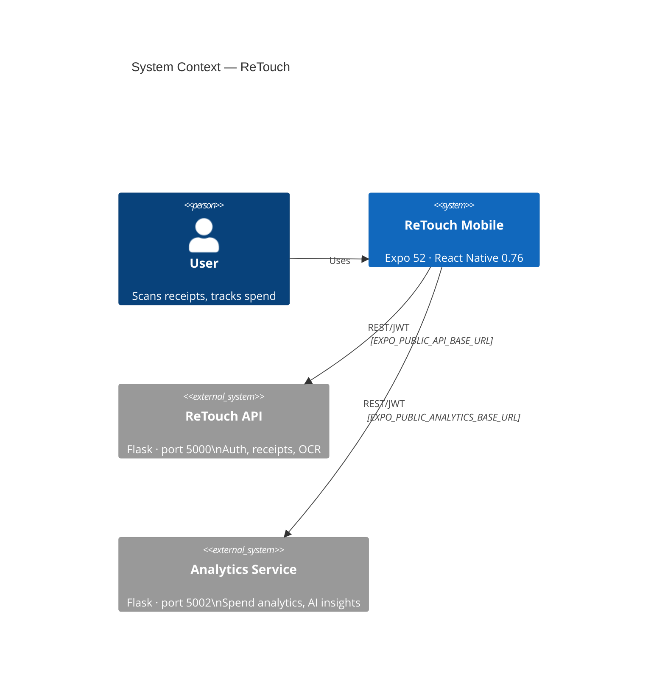
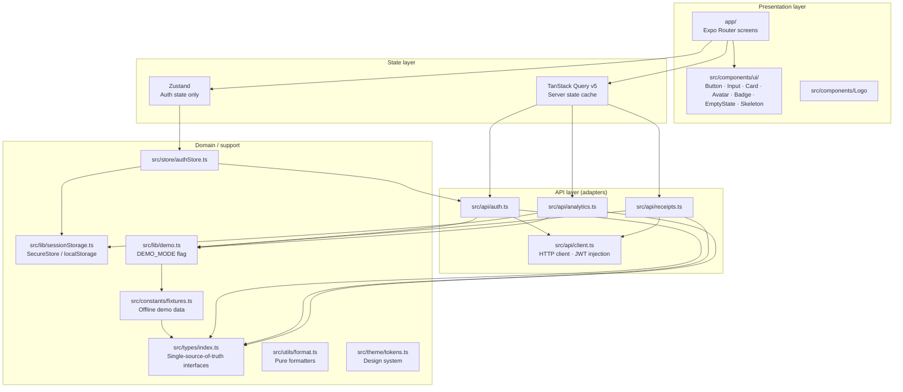
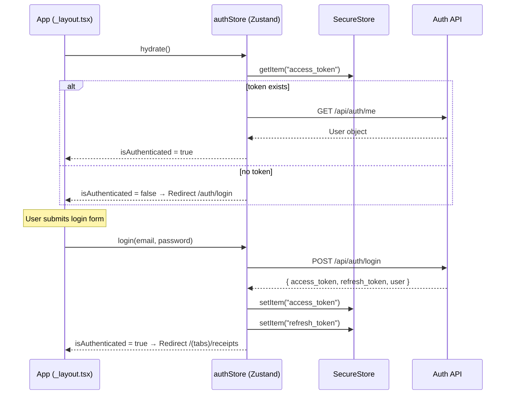
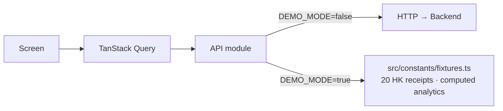

# ReTouch Mobile — Architecture

## System Context

ReTouch Mobile is a standalone React Native / Expo app. It communicates with two backend services over HTTP but has zero code imports from the server repositories.



> **Standalone guarantee**: The mobile app contains no `import` or file-path references to the server repositories. All integration is via HTTP calls to configurable base URLs.

---

## App Architecture

The app follows a strict layered architecture. Each layer only imports from layers below it.



---

## Directory Structure

```
ReTouch-mobile/
├── app/                        # Expo Router — file-based routes
│   ├── _layout.tsx             # Root layout: QueryClient, auth guard, safe area
│   ├── auth/
│   │   ├── _layout.tsx
│   │   ├── login.tsx
│   │   └── register.tsx
│   ├── (tabs)/
│   │   ├── _layout.tsx         # Tab bar configuration
│   │   ├── receipts.tsx        # Receipt list with skeleton loading
│   │   ├── capture.tsx         # Camera / gallery upload
│   │   ├── analytics.tsx       # Spend analytics
│   │   └── profile.tsx         # User profile + sign-out
│   └── receipt/[id].tsx        # Receipt detail (dynamic route)
│
├── src/
│   ├── types/index.ts          # All shared TypeScript interfaces
│   ├── api/
│   │   ├── client.ts           # Base HTTP client
│   │   ├── auth.ts             # Auth endpoints
│   │   ├── receipts.ts         # Receipt endpoints
│   │   └── analytics.ts        # Analytics endpoints
│   ├── store/
│   │   └── authStore.ts        # Zustand: auth state
│   ├── components/
│   │   ├── ui/                 # Atomic reusable components
│   │   │   ├── Avatar.tsx
│   │   │   ├── Badge.tsx
│   │   │   ├── Button.tsx
│   │   │   ├── Card.tsx
│   │   │   ├── EmptyState.tsx
│   │   │   ├── Input.tsx
│   │   │   ├── Skeleton.tsx
│   │   │   └── index.ts
│   │   └── Logo.tsx
│   ├── constants/
│   │   └── fixtures.ts         # Demo data (20 HK receipts + analytics)
│   ├── hooks/                  # (reserved for future domain hooks)
│   ├── lib/
│   │   ├── demo.ts             # DEMO_MODE env flag
│   │   └── sessionStorage.ts   # Platform-aware token storage
│   ├── theme/
│   │   └── tokens.ts           # Colors, spacing, radius, shadows, fonts
│   ├── utils/
│   │   └── format.ts           # Pure formatters (currency, date, time)
│   └── __tests__/              # Jest unit + integration tests
│
├── docs/                       # Architecture documentation
│   └── ARCHITECTURE.md
├── .env.example                # Environment variable reference
└── README.md
```

---

## Authentication Flow



---

## Receipt Upload Flow

```mermaid
sequenceDiagram
  participant User
  participant Capture as CaptureScreen
  participant API as Receipts API
  participant Server as ReTouch API

  User->>Capture: pick image (camera / gallery)
  Capture->>User: preview image
  User->>Capture: press "Upload receipt"
  Capture->>API: receiptsApi.upload(uri, mimeType)
  API->>Server: POST /api/mobile/receipts (FormData)
  Server-->>API: { receipt_id, upload_status: "pending" }
  API-->>Capture: UploadResponse
  Capture->>Capture: invalidate "receipts" query
  Capture->>User: success state (800ms)
  Capture->>User: navigate to /receipt/{id}
  note over User: OCR runs server-side; screen polls every 5s
```

---

## Demo Mode

Set `EXPO_PUBLIC_DEMO_MODE=true` in your `.env` to run the app fully offline. All API modules check the `DEMO_MODE` flag and return computed data from `src/constants/fixtures.ts` instead of making network requests.



The demo user is `iamsaleh.furqan@gmail.com`. Any password is accepted in demo mode.

---

## Design System

All design tokens live in `src/theme/tokens.ts`:

| Token group | Purpose |
|-------------|---------|
| `colors`    | Brand (cyan `#1BC5E3`), backgrounds, text hierarchy, semantic states |
| `spacing`   | 8-point scale: `xs/sm/md/lg/xl/2xl/3xl/4xl` |
| `radius`    | `sm/md/lg/xl/2xl/full` |
| `shadow`    | `sm/md/glow` (with cyan glow for primary CTAs) |
| `fonts`     | Space Grotesk (headings), Manrope (body), IBM Plex Mono (numbers) |

---

## Testing Strategy

| Layer | Tool | What it tests |
|-------|------|---------------|
| Auth store | Jest + `@testing-library/react-native` | Hydration, login, register, logout, token refresh |
| Auth screens | RNTL + mocked authStore | Form validation, API errors, navigation |
| Receipt screens | RNTL + mocked receiptsApi | List rendering, search, pagination, error states |
| Analytics screen | RNTL + mocked analyticsApi | Summary cards, merchants, categories, insights |
| Capture screen | RNTL + mocked ImagePicker | Picker, upload states, retry |
| Profile screen | RNTL + mocked authStore | Avatar, sign-out confirmation dialog |
| Receipt detail | RNTL + mocked receiptsApi | Merchant info, line items, OCR confidence, polling |

Run: `npm test` (62 tests, ~5 s)
